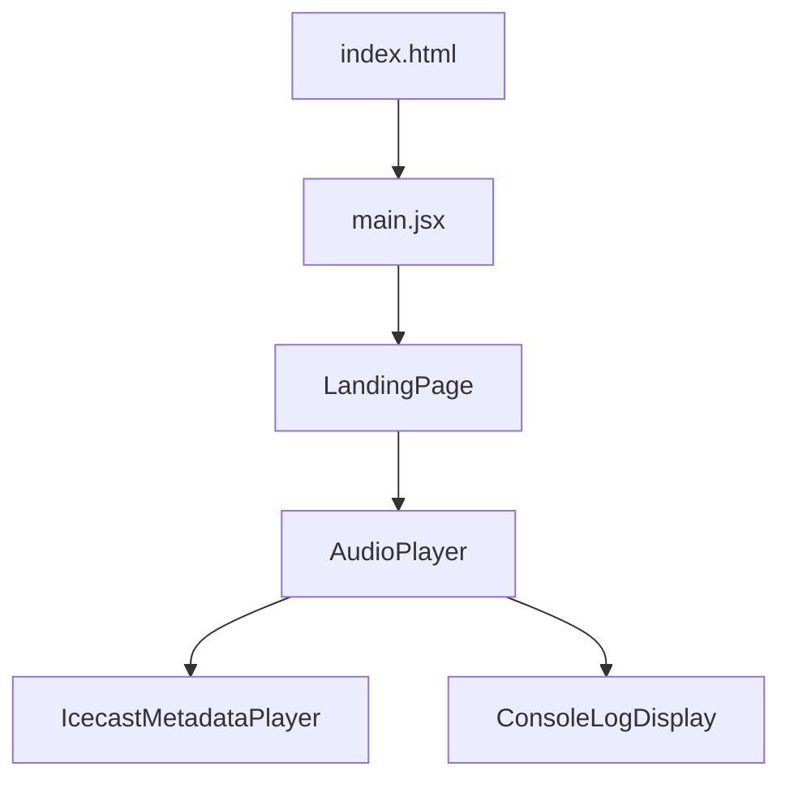
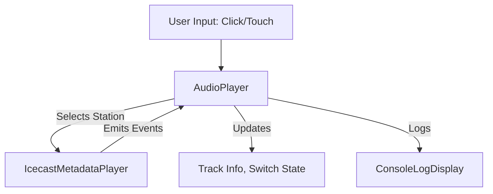
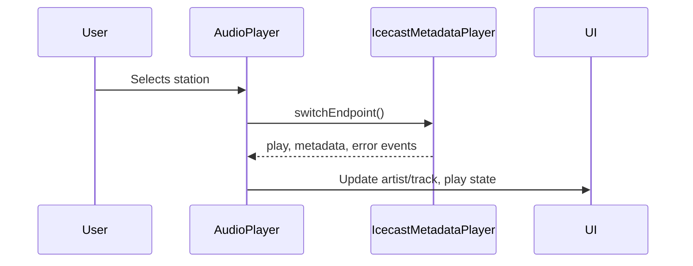

# third block fm — Architecture & Flow Documentation

## Project Overview

**third block fm** is a web-based audio streaming interface built with React and Vite, designed with a retro/pixel aesthetic. It allows users to switch between multiple audio streams ("stations") and displays real-time track metadata. The project is optimized for deployment on GitHub Pages.

---

## High-Level Architecture

- **index.html**: Loads the React app and global styles.
- **main.jsx**: Mounts the root React component (`LandingPage`).
- **LandingPage.jsx**: Main UI container, renders the `AudioPlayer`.
- **AudioPlayer.jsx**: Core logic for audio playback, station switching, and metadata handling using IcecastMetadataPlayer.
- **ConsoleLogDisplay.jsx**: (Dev only) Overlays console logs for debugging.
- **IcecastMetadataPlayer**: Handles streaming and metadata events for the selected station.

---

## Component Structure & Data Flow

- User interacts with station switches.
- AudioPlayer manages playback and metadata via IcecastMetadataPlayer.
- UI updates reflect current station, artist, and track.
- ConsoleLogDisplay shows logs in development mode.

---

## Audio Playback Logic

- **Stations**: Defined as objects with id, name, streamUrl, and mountPoint.
- **IcecastMetadataPlayer**: Single instance manages playback and metadata for the selected station.
- **Event Handling**: AudioPlayer listens for play, pause, metadata, and error events from IcecastMetadataPlayer.
- **Play/Pause**: Toggling play state is handled via the player instance.
- **Buffering/Loading**: UI indicates loading state during transitions.

---

## Metadata Handling

- Metadata is received via 'metadata' events from IcecastMetadataPlayer.
- Artist and track info are parsed from ICY metadata (StreamTitle).
- Error handling resets to "unknown artist/track" on failure.

---

## Development & Debugging

- **ConsoleLogDisplay**: In development mode, all console logs/errors/warnings are displayed in a fixed overlay for easy debugging, including on mobile devices.

---

## Deployment & Build Pipeline

- Built with Vite for fast development and optimized builds.
- Deployed to GitHub Pages (`base` set in vite.config.js, deploy script uses `gh-pages`).
- All assets and routes are relative to `/thirdblockfm/`.

---

## File Structure

- `index.html` — Entry point, links styles and root div.
- `vite.config.js` — Vite config, React plugin, GitHub Pages base.
- `package.json` — Scripts, dependencies, deploy setup.
- `src/main.jsx` — React root, renders `LandingPage`.
- `src/LandingPage.jsx` — Main UI, renders `AudioPlayer`.
- `src/components/AudioPlayer.jsx` — Core audio logic.
- `src/components/AudioPlayer.css` — Retro/pixel styles for player.
- `src/components/ConsoleLogDisplay.jsx` — Dev log overlay.

---

## Sequence Diagram: Station Switch & Metadata Update

---

## Notes

- All audio logic is encapsulated in `AudioPlayer.jsx` for maintainability.
- The system is designed for extensibility (add more stations easily).
- UI is responsive and adapts to small screens, but see issues doc for mobile limitations.
- The project relies on the IcecastMetadataPlayer library for streaming and metadata; see issues doc for third-party library considerations.

---

## 2025 Architectural Priorities & Recommendations

- **Accessibility**: Refactor UI and event handling to support ARIA roles, keyboard navigation, and larger touch targets.
- **User Feedback**: Implement user-facing error and loading states for audio and metadata.
- **Mobile Optimization**: Test and optimize for a variety of devices and browsers; consider Media Session API for improved mobile controls.
- **Customization**: Add support for dark mode/high-contrast themes and user-adjustable font sizes.
- **Maintainability**: Ensure all event listeners are properly cleaned up and code is modular for future enhancements.

For a full, prioritized list of improvements and design focus areas, see:
- "Actionable Recommendations" in ISSUES_AND_IMPROVEMENTS.md
- "2025 Recommendations & Focus Areas" in DESIGN_AND_PRINCIPLES.md

These priorities will guide ongoing development and ensure the architecture remains robust, accessible, and user-friendly.
